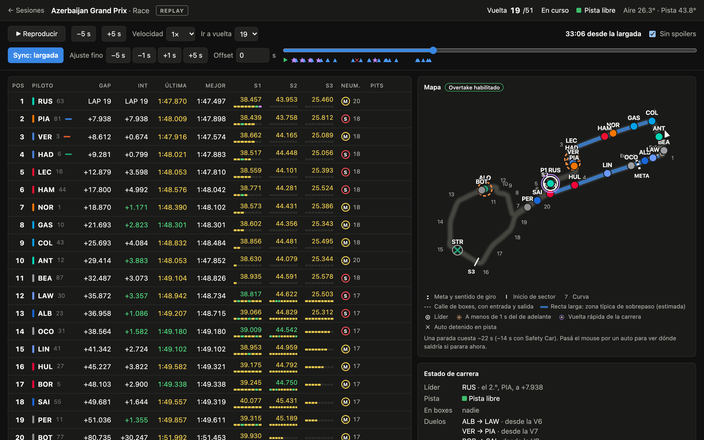
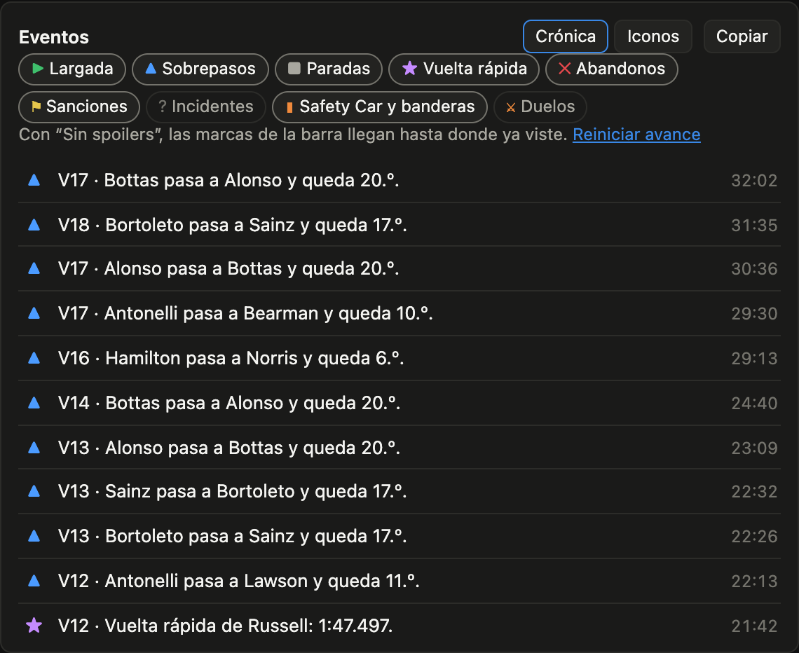
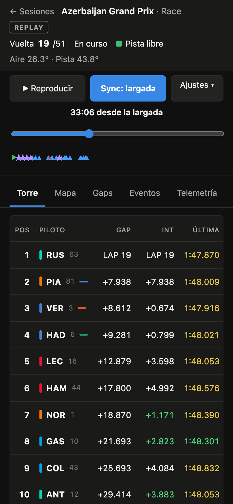
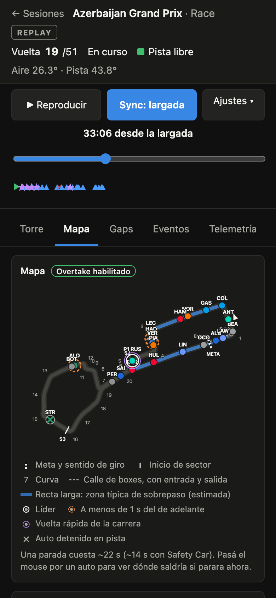

# F1 Tracker



**Español.** Tracker personal de F1 para ver una sesión sincronizada con el video: torre de tiempos, mapa, gaps, telemetría y una línea de eventos (sobrepasos, paradas, undercuts, Safety Car) sobre la barra de avance, con crónica en español y sin spoilers. Corre entero en el navegador, sin server, y se actualiza solo.

**English.** A personal F1 tracker to follow a session in sync with the video: timing tower, track map, gaps, telemetry and an event timeline (overtakes, pit stops, undercuts, Safety Cars) over the scrubber, with a Spanish race log and spoiler-free by default. It runs fully in the browser, no server, and updates itself.

**Demo: <https://lkatcheroff.github.io/f1-tracker/>** · Proyecto no oficial, sin afiliación con Formula 1 · Unofficial, not affiliated with Formula 1.

## Qué hace

- **Replay sincronizado con el video**: apretás *Sync: largada* cuando se apagan los semáforos y el resto sigue solo. Con *Sin spoilers* la barra va por vuelta y nada muestra lo que todavía no viste.
- **Eventos sobre la barra** y crónica generada por reglas (sin IA): sobrepasos, cambios de líder, paradas, vuelta rápida, abandonos, sanciones, duelos, undercut y overcut. Un clic salta al momento.
- **Estrategia**: ritmo por neumático, proyección de "lo alcanza en N vueltas", dominio por tramos de pista, vuelta ideal y velocidades máximas.
- **Telemetría y comparación** entre vueltas y pilotos, con mini-sectores en la torre.
- **Clasificación** con corte, eliminados y tiempo restante de cada parte.
- **Móvil**: pestañas (Torre, Mapa, Gaps, Eventos, Telemetría) y controles táctiles.

| Eventos | Móvil: torre | Móvil: mapa |
|---|---|---|
|  |  |  |

## Cómo está hecho

```
 OpenF1 ──► Action (cada 15 min) ──► sitio estático ──► Web Worker ─┐
 Feed F1 ──► server local ─────────────────────────────► WebSocket ─┤
                                                                    ▼
                                         ReplayPlayer + StateEngine (mismo código)
                                                                    ▼
                                         buildInsights: eventos, crónica, estrategia
```

- **Un solo motor.** El replay y el live usan el mismo `StateEngine` y el mismo formato de mensajes; cambia solo la fuente. En el sitio estático el motor corre en un Web Worker.
- **`packages/core` es puro**: sin red ni disco, así se prueba con carreras sintéticas y corre igual en el server y en el navegador.
- **Reglas determinísticas.** El análisis (`buildInsights`) recorre la sesión una vez, tarda ~140 ms en una carrera completa y da el mismo resultado con cualquier fuente.
- **Sin spoilers por construcción.** Una sola compuerta decide qué eventos y vueltas son visibles en cada instante.
- **Por qué OpenF1 en el sitio publicado.** F1 le responde 403 a los servidores de GitHub (verificado, ver `docs/spikes.md`), así que la Action arma las sesiones desde OpenF1. Medido contra el feed oficial: mismos 287 cambios de posición en Bakú y telemetría casi idéntica.

## Datos y límites

Cada sesión avisa en pantalla cuando sus datos no vienen del archivo oficial. Con OpenF1 faltan el Safety Car en el mapa y los mini-sectores reales, y los abandonos y el estado de pista son aproximados. El live necesita el server local y no trae posiciones sin cuenta de F1. Detalle y enlaces en [`docs/DATA_SOURCES.md`](docs/DATA_SOURCES.md); mediciones en [`docs/spikes.md`](docs/spikes.md).

Datos de [OpenF1](https://openf1.org); trazados y curvas de [MultiViewer](https://multiviewer.app). F1 y los nombres relacionados son marcas de sus dueños.

## Uso

```bash
npm install
npm run dev
```

Abre `http://localhost:5173`. El server propio corre en `127.0.0.1:8787` (se cambia con `F1_SERVER_PORT`).

### Replay

1. Elegí la sesión en la lista (no muestra resultados).
2. Poné el video. Cuando se apagan los semáforos, apretá **Sync: largada**.
3. Si quedó corrido, usá **Ajuste fino** (±1 s, ±5 s) o el campo **Offset**. El offset se recuerda por sesión y se aplica en el próximo sync.

Atajos: espacio = play/pausa, ←/→ = ±5 s. La posición se guarda para retomar. Agregando `?t=<segundos>` a la URL de un replay se abre en ese punto.

Con **Sin spoilers** activado, la barra de avance va por vuelta y no se muestra la duración total.

Fuentes del replay, en este orden:

- **Archivo estático de F1**: disponible unos 30 minutos después del final de la sesión. Se baja una vez y queda en `data/cache/`.
- **OpenF1** ("vía OpenF1" en la lista): para sesiones que F1 todavía no publicó. La primera carga tarda cerca de un minuto por el rate limit.
- **Grabaciones propias**: lo que grabó el modo live, en `data/recordings/`.

### Live

**Seguir en vivo** conecta el server al feed SignalR de F1, sin cuenta, y graba todo lo que entra. El panel de topics muestra qué datos llegan. Sin cuenta de F1 no llegan posiciones ni telemetría, así que el live no tiene mapa. Ver `docs/spikes.md`.

## El mapa

Sobre el trazado se marcan: meta y sentido de giro, inicio de cada sector, números de curva, calle de boxes con entrada y salida, y las rectas largas (zonas típicas de sobrepaso; es una estimación por geometría, el feed no publica zonas oficiales).

En carrera: líder, quién tiene la vuelta rápida, autos a menos de 1 s del de adelante, banderas azules, autos detenidos en pista, el Safety Car mientras está desplegado, banderas amarillas por sector y el trazado teñido según el estado de pista. Al pasar el mouse por un auto se ve su gap, neumático y en qué posición saldría si parara ahora.

En práctica y clasificación: quién viene en vuelta con récord de sector, quién viene mejorando su marca y quién está en vuelta de salida o de entrada.

En clasificación, la torre muestra cuánto queda de Q1, Q2 o Q3, la columna **Corte** (cuánto le sobra al que pasa o cuánto le falta al que está afuera), la línea del corte y, en rojo, los que hoy quedan eliminados. Al arrancar Q2 y Q3, los tiempos de la parte anterior desaparecen para los que pasaron.

Curvas, sectores de banderilleros y costo de la parada salen de la API pública de MultiViewer. Si no responde, el mapa se dibuja sin esas marcas.

## Telemetría y comparación

Los **mini-sectores** de cada piloto se ven dentro de las celdas S1, S2 y S3 de la torre: una barrita por mini-sector, violeta si es la mejor marca de la sesión, verde si es mejor marca propia y amarillo si no mejora. Se completan a medida que el auto avanza.

El panel **Telemetría y comparación** (debajo de la torre, se abre a pedido) compara dos vueltas a lo largo de la pista, en metros desde la meta, con la meta, los sectores y los números de curva marcados:

- **Diferencia de tiempo** acumulada, velocidad, acelerador, freno y marcha, con un cursor compartido y una lectura al instante de cada piloto.
- **Vuelta en curso:** se dibuja a medida que avanza la vuelta del piloto elegido y se compara contra la referencia punto a punto. Al cerrar la vuelta queda completa.
- **Referencias:** la mejor vuelta de la sesión hasta ese momento, su mejor vuelta, su vuelta anterior, otro piloto (compañero, auto de adelante o de atrás, o cualquiera) y, en clasificación, el último que pasa y el primero que queda afuera de esa parte. Por defecto: el corte en clasificación y la mejor de la sesión en el resto.
- **Después de la sesión:** se puede elegir cualquier vuelta de cualquier piloto. Con **Sin spoilers** activado solo aparecen las vueltas ya cerradas en el momento que se está viendo; sin él, todas.
- Tabla de S1, S2, S3 y vuelta con la diferencia en cada tramo.

La telemetría sale de la posición y de `car_data`/`CarData.z` de cada auto, remuestreada en 300 puntos por vuelta. Los tiempos de sector se derivan de esa traza y suman el tiempo oficial de la vuelta. Se descartan las vueltas que no se pueden medir con confianza (la 1 de una carrera, algunas vueltas de boxes bajo Safety Car). En una misma carrera, el feed oficial y OpenF1 dan la misma telemetría: tiempos de vuelta idénticos al milisegundo y 0,7 km/h de diferencia media en velocidad.

La telemetría **no está en el modo live** (sin cuenta de F1 el feed no trae posiciones ni telemetría) ni en las sesiones que se abren directo desde OpenF1 en el navegador.

## Sitio en GitHub Pages

`npm run build:pages` arma una versión estática: el replay corre entero en el navegador (Web Worker), sin server. El workflow `.github/workflows/pages.yml` la publica y la mantiene al día:

- En cada push a `main`, y cada 15 minutos, corre `scripts/mirror.ts`: lee el calendario, baja las sesiones que falten, las procesa (1 a 4 MB cada una) y republica el sitio. Una sesión nueva aparece entre 45 y 75 minutos después de terminar.
- **Los datos del sitio salen de OpenF1**, no del archivo de F1: F1 le responde 403 a los servidores de GitHub. Respecto del feed oficial faltan el Safety Car en el mapa y los mini-sectores; los abandonos y el estado de pista son aproximados. Con `npm run dev` en tu máquina el replay usa el archivo oficial completo.
- Publica las últimas 40 sesiones (`MIRROR_MAX_SESSIONS` en el workflow), de a 10 nuevas por corrida por el rate limit de OpenF1. Cada sesión sale en dos archivos: `s/` (la sesión, 1 a 4 MB) y `t/` (su telemetría, 0,4 a 1,5 MB). El resto, y las temporadas desde 2023, se cargan desde OpenF1 en el navegador; la primera carga tarda cerca de un minuto.
- El modo live no está en el sitio: necesita un server conectado al feed. Sigue disponible en local con `npm run dev`.

Para activarlo: repo público en GitHub, y en Settings → Pages → Source elegir "GitHub Actions".

Para probar el sitio estático en local:

```bash
MIRROR_SOURCE=openf1 npm run mirror -- site-data --max 4   # sin MIRROR_SOURCE usa el archivo de F1
npm run build:pages && cp -r site-data apps/web/dist/data
npx vite preview --outDir apps/web/dist
```

## Estructura

- `packages/core`: tipos, parser `.jsonStream`, decoder `.z`, `StateEngine` (deep-merge + checkpoints), `ReplayPlayer` (reloj + seek) e índice del replay. Sin I/O.
- `packages/openf1`: cliente de OpenF1 y traducción al formato del feed. Corre en el server y en el navegador.
- `apps/server`: Fastify + WebSocket. Replay, `LiveSource`, `Recorder`, caché en disco.
- `apps/web`: Vite + React. Timing tower, mapa, gráfico de gaps, Race Control. Habla con el server por WebSocket o, en el sitio estático, con un Web Worker.
- `scripts/mirror.ts`: arma los datos del sitio estático.
- `docs/SPEC.md`: la spec original. `docs/spikes.md`: resultados de la Fase 0.

Los dos modos usan el mismo formato de mensajes y el mismo `StateEngine`; cambia solo la fuente.

## Desarrollo, tests y CI

```bash
npm run check          # tipos + lint + tests: lo que tiene que estar en verde antes de subir
npm run format         # formatea con Biome
npm run fixture        # baja la carrera de Azerbaiyán 2026 a fixtures/ (25 MB, solo desde una conexión hogareña)
npm run fixture:schema # regenera packages/core/test/schema.json (la forma de los mensajes, sin valores)
npm run e2e:mobile      # aceptación en 390×844 (necesita `npm run dev` y Chrome; no corre en CI)
npm run screenshots    # regenera docs/img/ (ídem)
```

**Dos tipos de tests**, con el mismo comando:

- **Sintéticos (corren siempre, también en CI).** `packages/core/test/builders.ts` arma carreras inventadas (pilotos `AAA`, `BBB`…) con mensajes de la **forma real** del feed: un test de contrato verifica que todo lo que emite el builder exista en `schema.json`, que contiene solo rutas y tipos de los mensajes reales, sin valores. Así se testea sin redistribuir datos del feed.
- **Contra la carrera real (`[requiere datos reales]`).** Validan el motor y la telemetría contra la fixture de Bakú. Se corren en local; en CI se saltean porque F1 le responde 403 a los servidores de GitHub y la fixture no se sube al repo. El resumen del job muestra cuántos se saltearon.

**Jobs de `.github/workflows/pages.yml`:**

| Job | Cuándo | Qué hace |
|---|---|---|
| `check` | push, manual y cron | Tipos siempre; lint y tests salvo en el cron |
| `build` | push, manual y cron | Procesa las sesiones nuevas (OpenF1), arma el sitio y lo sube como artefacto si hubo cambios |
| `deploy` | cuando `build` tiene algo para publicar | Publica en Pages. Un push solo se publica si `check` pasó |

## Licencia

MIT para el código (ver `LICENSE`). Los datos de tiempos que muestra son de terceros (F1, OpenF1, MultiViewer) y quedan fuera de la licencia. Proyecto personal, no oficial, sin afiliación con Formula 1.

## Diferencias con la spec

- **npm workspaces en vez de pnpm**: pnpm no estaba instalado y el de corepack fallaba. La estructura es la misma.
- **Cliente SignalR propio** (unas 100 líneas sobre `ws`) en vez de `@microsoft/signalr`: hace falta mandar la cookie del balanceador en el WebSocket.
- **Mirror de FastF1**: responde 404, no se usa.
- **El replay no pasa por la interface `DataSource`**: lo maneja `ReplayPlayer` sobre la lista completa de mensajes, para que el mismo código corra en el server y en el navegador. `DataSource` queda para el live.
